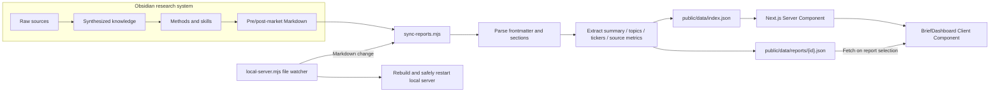

# US LENS — AI-Assisted US Equity Research & Visualization

[简体中文](README.md) · [English](README.en.md)

US LENS turns fragmented market information into a repeatable research workflow. Research, AI-assisted analysis, and evidence classification happen in Obsidian; a publishing pipeline then converts the briefs into a searchable, responsive pre-market and post-market web archive.

This is more than a daily-news page. It is an end-to-end personal research product connecting information capture, knowledge synthesis, AI workflows, content production, and web delivery.

[View the static interface demo](https://tttttracycui.github.io/us-lens-daily/) (fixed GitHub Pages showcase build; no daily synchronization)

## What it helps with

Market information is abundant. The harder problems are:

- News, filings, macro data, and market sentiment live across disconnected sources.
- AI can produce fluent analysis without clearly separating evidence from inference.
- Markdown is excellent for research but not ideal for fast, accessible reading.
- Repeating the same collection, publishing, and archiving steps every day is fragile.

US LENS addresses these problems as a sustainable product workflow:

1. Obsidian stores source material, research frameworks, reusable skills, and historical output.
2. AI accelerates synthesis and structured writing while preserving source levels and unresolved questions.
3. A consistent information architecture separates facts, interpretation, sentiment, validation items, and risks.
4. Markdown reports are converted into a lightweight index and per-report JSON documents.
5. The web app provides historical search, pre/post-market switching, section navigation, evidence filters, and responsive reading.

The reading experience is designed to answer three questions: **What happened? Why does it matter? What should be verified next?**

## Project highlights

| Dimension | Implementation |
| --- | --- |
| Product architecture | Connects pre-market preparation, post-market review, historical lookup, terminology support, and validation checklists around the problem of information overload |
| AI workflow | Encodes source hierarchy, evidence labels, counterarguments, unresolved items, and output contracts into reusable skills and templates instead of one-off prompts |
| Experience design | Uses an editorial visual system, five semantic evidence tokens, responsive layouts, dark mode, and explicit status feedback to improve readability |
| Engineering | Implements a Markdown-to-JSON pipeline, index/detail data splitting, SSR, file-watch rebuilds, Node tests, Cloudflare Workers, and Sites deployment |
| Content operations | Connects daily research, brand assets, and social content into one system designed for continuous production |

## Product design: from research tool to reader product

### Users and jobs to be done

- **US equity beginners** need plain-language explanations, terminology support, and clear risk boundaries.
- **Experienced investors and researchers** need sources, validation points, and cross-period review.
- **Content creators** need reliable pre-market/post-market templates, a historical archive, and a repeatable publishing workflow.

### Key product decisions

- **Evidence before opinion:** content is classified as fact, interpretation, sentiment, validation item, or risk whenever possible.
- **Research and presentation are separate:** Obsidian is the single content source; the website never writes back to the research vault.
- **A lightweight homepage:** the initial page loads only `index.json`; full report details are fetched on selection.
- **Pre-market and post-market are different tasks:** pre-market briefs emphasize observation and verification, while post-market briefs emphasize review and next-session follow-up.
- **Limitations remain visible:** report status, timestamps, source counts, and unresolved items are part of the interface instead of being hidden in a disclaimer.

## AI workflow: turning prompts into a research system

US LENS does not simply ask a model to “write a market brief.” It encodes a research method into a reusable workflow:

```text
Research objective
  ├─ Source hierarchy: SEC / company IR / official data / major media / industry media / social signals
  ├─ Analysis framework: facts → impact chain → value-chain mapping → counterarguments → validation signals
  ├─ Quality gates: timestamps, source counts, conflict disclosure, unresolved items
  └─ Output contracts: pre-market brief / post-market brief / terminology / next-session checklist
```

The workflow demonstrates:

- decomposing research methods into skills, references, checklists, and templates;
- constraining model output structurally instead of only changing writing style;
- applying different evidence standards to facts, inference, and market sentiment;
- preserving conflicting data, inaccessible sources, and unverified assumptions;
- keeping final source judgment and publishing decisions under human review.

> The complete Obsidian vault and real daily briefs are private. This repository publishes only the product layer, synchronization logic, data contract, and fully fictional interface data.

## Public repository boundary: bring your own AI agent

This repository is a **runnable and extensible publishing framework**. It is not an autonomous investment agent with built-in news collection, model accounts, or private prompts.

It includes:

- one fully fictional sample report and the web reading experience;
- the Obsidian Markdown-to-JSON synchronization pipeline;
- report indexing, historical search, evidence filters, and responsive UI;
- local build automation, tests, and deployment configuration;
- a Markdown output contract that any AI agent can target.

It does not include:

- my private Obsidian vault, research material, or complete skill library;
- API keys for OpenAI, Anthropic, Gemini, or any other model provider;
- paid data feeds, brokerage accounts, login cookies, or access tokens;
- a built-in agent that performs fact-checking or investment judgment for you.

Recommended integration:

```text
Your own AI agent
  ├─ Uses your own model and data-provider credentials
  ├─ Performs retrieval, verification, evidence classification, and human review
  └─ Writes Markdown into your own Obsidian vault
                              ↓
                      sync-reports.mjs
                              ↓
                    JSON data + US LENS web app
```

### AI agent output contract

Write pre-market reports to:

```text
03-输出与复盘层/00-每日看板/00-盘前
```

Write post-market reports to:

```text
03-输出与复盘层/00-每日看板/01-盘中与收盘
```

The generated Markdown should include frontmatter and level-two sections similar to:

```markdown
---
type: us-market-premarket-hotspots
market: us-equity
report_date: YYYY-MM-DD
upcoming_session_date: YYYY-MM-DD
as_of: YYYY-MM-DD HH:mm Asia/Hong_Kong
status: complete
tags: [US equities, pre-market brief]
---

# YYYY-MM-DD US Pre-Market Hotspot Brief

## 1. Market summary

In plain language: ...

## 2. Top 10 market hotspots

### 1. Hotspot title

Facts, interpretation, risks, and sources...

## 3. Terminology

## 4. Themes to watch

## 5. Sentiment and risks

## 6. Next-session validation checklist

## 7. Source index
```

You can start from the [report template](examples/report-template.md). The synchronizer converts `##` headings into web sections, extracts topics from `###` headings in the hotspot section, and derives summary metrics from links, tickers, and evidence text.

### API key and privacy safety

- The web project **does not require or read any AI API key**.
- Keep model and data-provider credentials in your agent's environment variables, system keychain, or secret manager.
- Never place API keys in Markdown, JSON, scripts, screenshots, or Git commits.
- `.env*`, private-key files, and local build directories are excluded through `.gitignore`.
- Before publishing, always review:

```bash
git status --short
git diff --cached
git grep -n -I -E "API_KEY|ACCESS_TOKEN|PRIVATE_KEY"
```

If a credential has ever entered Git history, deleting the current file is not enough. Revoke and rotate the credential first, then clean the repository history.

## Interface design: making dense financial content readable

### Visual and interaction system

- **Editorial hierarchy:** headline, daily thesis, status indicators, evidence legend, sections, and body content create a stable reading order.
- **Semantic color:** fact, interpretation, sentiment, validation, and risk each have their own visual token.
- **Historical retrieval:** a drawer supports keyword, company, and ticker search with pre-market/post-market filters.
- **Long-form navigation:** desktop section navigation and reading progress are paired with a mobile action dock.
- **Themes and responsiveness:** light/dark themes and desktop, tablet, and mobile layouts.
- **Accessibility foundations:** skip link, semantic headings, dialog and tablist roles, `aria-current`, `aria-live`, and visible focus states.

Known improvement areas include reducing the height of the first mobile viewport and increasing secondary history text on smaller screens.

## Obsidian information architecture

The vault uses four layers to keep raw information, durable knowledge, reusable methods, and published output separate:

```text
00-Raw-Sources/
  ├─ News, SEC filings, company IR, research reports
  ├─ Market data, policy, regulation, data sources
  └─ Sentiment and events

01-Synthesized-Knowledge/
  ├─ Company profiles, industries, value chains, concept cards
  ├─ Risk registers and investment theses
  └─ Comparables and historical cases

02-Methods-and-Skills/
  ├─ Earnings analysis, valuation checks, risk review
  ├─ Daily brief, research, and retrospective templates
  ├─ Multi-framework pre-investment checks
  └─ Financial education assistant

03-Output-and-Review/
  ├─ Daily dashboard: pre-market / post-market / macro calendar
  ├─ Equity research, weekly reviews, thematic reports
  ├─ Watchlists and decision logs
  └─ Brand guidelines, social drafts, and visual assets
```

This architecture helps both AI retrieval and human review by preventing collected material, synthesized knowledge, methods, and final output from becoming one undifferentiated folder.

## Obsidian-to-web synchronization



The boundaries are intentional:

- **Content publication is one-way:** Obsidian → Web. The website cannot overwrite the research vault.
- **Runtime state is synchronized automatically:** a Markdown change triggers synchronization, rebuilding, and local restart.
- **Deployment remains a separate action:** local edits do not automatically overwrite the production site.

## Web / HTML structure and features

The application uses the Next.js App Router and React, producing semantic server-rendered HTML:

```text
RootLayout (Server Component)
└─ Home / app/page.tsx (Server Component)
   └─ BriefDashboard (Client Component)
      ├─ Header
      │  ├─ Section navigation
      │  ├─ Pre/post-market switch
      │  ├─ History drawer trigger
      │  └─ Theme toggle and reading progress
      ├─ Main
      │  ├─ Report hero and daily thesis
      │  ├─ Status metrics
      │  ├─ Evidence legend and focus controls
      │  ├─ Section jump navigation
      │  ├─ Hotspot Explorer
      │  └─ Markdown body and source links
      ├─ History Drawer
      │  ├─ Search
      │  ├─ Pre/post-market filters
      │  └─ Monthly archive
      └─ Mobile Dock
```

Key features:

- historical brief search and monthly archives;
- pre-market/post-market switching;
- URL query persistence for the selected report;
- asynchronous per-report JSON loading with retry states;
- Markdown/GFM tables and safe external-link rendering;
- a tabbed Hotspot Explorer;
- evidence-type filtering and visual highlighting;
- section navigation, scroll progress, keyboard shortcuts, and focus management;
- light/dark themes and responsive mobile layouts.

## Technology

- **Frontend:** Next.js 16, React 19, TypeScript, React Markdown, Phosphor Icons
- **Design:** CSS custom properties, responsive layouts, dark mode, semantic evidence tokens
- **Content pipeline:** Node.js, Markdown frontmatter, JSON index/detail contract
- **Runtime:** vinext, Vite, Cloudflare Workers, OpenAI Sites
- **Quality:** ESLint, strict TypeScript, Node tests, SSR contract tests, GitHub Actions
- **Local automation:** Node child processes, file watching, zsh, AppleScript

## Run locally

### Explore the fictional example

The project starts without a private Obsidian vault. It includes one clearly labeled fictional Demo report and no real daily briefs:

```bash
npm ci
npm run dev
```

### Connect your own Obsidian vault

The vault should contain:

```text
03-输出与复盘层/00-每日看板/00-盘前
03-输出与复盘层/00-每日看板/01-盘中与收盘
```

Set the content source, synchronize, and build:

```bash
export US_DAILY_VAULT="/absolute/path/to/your/vault"
npm run refresh
```

`refresh` only reads Markdown that your agent has already generated and reviewed; it never calls a model. If the expected Obsidian directories cannot be found, synchronization exits safely without changing the public Demo index.

Set your own deployment domain through `NEXT_PUBLIC_SITE_URL`. Sites project bindings are not committed: copy `.openai/hosting.example.json` to `.openai/hosting.json` and insert your own project ID when needed.

### macOS daily workflow

The repository keeps its AppleScript and zsh start/stop workflow under `scripts/macos/`. The local service binds only to `127.0.0.1:3001` and is not exposed to the local network. It can also be started directly:

```bash
npm run local
```

## Quality checks

```bash
npm run lint
npm test
npm run validate
```

Tests cover:

- Cloudflare Worker server-side rendering;
- core Chinese product copy and empty states;
- the five-category evidence taxonomy;
- public index/detail data contracts;
- report ID uniqueness, URL integrity, ordering, and relative source paths.

GitHub Actions runs the complete validation workflow on every push and pull request.

## Repository structure

```text
app/                    Next.js pages, components, types, and global design system
public/data/            Fictional Demo; locally generated real reports are ignored
scripts/                Obsidian synchronization, local manager, brand asset tools
scripts/macos/          macOS start/stop workflow
tests/                  SSR and public-data contract tests
worker/                 Cloudflare Worker entry point
.github/workflows/      Continuous integration
```

## Engineering trade-offs

- Reports are currently shipped as static JSON for transparent, cache-friendly, and auditable deployment. Object storage or a search service can be introduced as the archive grows.
- `BriefDashboard.tsx` currently owns many interactions. This accelerated iteration, but the component should eventually be separated into history, evidence, hotspot, and Markdown-rendering modules.
- The product is not a real-time trading terminal. It does not display unverifiable live prices or generate personalized investment advice.

## Roadmap

- split the large dashboard into focused components and add component-level tests;
- add fixture-based unit tests for the report parser;
- build cross-period topic and ticker aggregation;
- improve mobile first-viewport density and history-summary typography;
- add more fully synthetic fixtures for the report parser.

## Disclaimer

This project is intended for public-information research and financial education. It does not provide investment advice or trading instructions.
