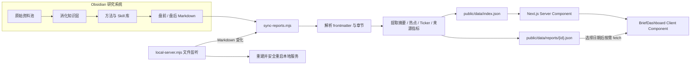

# US LENS — AI 辅助美股研究与可视化系统

[简体中文](README.md) · [English](README.en.md)

US LENS 把分散的市场信息组织成一条可重复的研究工作流：在 Obsidian 中完成资料沉淀、AI 辅助分析与证据分层，再自动同步成可搜索、可回看、适合普通读者阅读的盘前 / 盘后简报网页。

它不只是一个日报页面，而是一个从「信息采集 → 知识消化 → AI 工作流 → 内容生产 → Web 产品化」闭环运行的个人研究产品。

[查看静态界面 Demo](https://us-lens-daily-brief.yhy86c5pm6.chatgpt.site)（固定展示版本，不同步每日更新）

## 它解决什么问题

美股信息并不稀缺，真正困难的是：

- 新闻、财报、宏观数据和市场情绪分散在不同来源，难以形成连续判断；
- AI 很容易生成流畅但证据边界不清的内容；
- Markdown 适合研究和积累，却不适合非专业读者快速浏览；
- 每天重复整理、发布和归档，人工流程容易中断。

US LENS 将这些问题拆成一套可持续的产品机制：

1. 用 Obsidian 保存原始资料、研究框架、Skill 和历史输出；
2. 用 AI 加速归纳、解释和结构化写作，同时保留来源等级与待核实项；
3. 用固定信息架构区分「事实、市场解读、市场情绪、待验证、风险」；
4. 将 Markdown 自动转换为轻量索引与逐篇 JSON；
5. 在网页端提供历史搜索、盘前 / 盘后切换、章节导航、证据筛选和响应式阅读。

最终，读者得到的不是“更多信息”，而是更容易回答三个问题的阅读产品：**发生了什么、为什么重要、接下来验证什么。**

## 项目亮点

| 维度 | 项目中的实现 |
| --- | --- |
| 产品架构 | 围绕信息过载问题，连接盘前观察、盘后复盘、历史回看、术语解释和验证清单等完整场景 |
| AI 工作流 | 将来源层级、证据标签、反证思维、待核实项和固定输出结构写入可复用 Skill / 模板，而不是依赖一次性 prompt |
| 体验设计 | 建立 editorial 风格的视觉系统，用 5 类证据 token、信息层级、响应式布局、深色模式和明确状态反馈降低阅读门槛 |
| 工程实现 | 实现 Markdown → JSON 内容管线、索引与详情分离加载、SSR、自动监听重建、Node 测试、Cloudflare Worker 与 Sites 部署 |
| 内容运营 | 把日报、品牌视觉和社媒素材纳入同一内容系统，支持持续生产而非一次性 Demo |

## 产品设计：从研究工具到读者产品

### 用户与场景

- **美股初学者**：需要术语解释、通俗总结和明确的风险边界；
- **有经验的投资者 / 研究者**：需要来源、验证点和跨期回看；
- **内容创作者**：需要稳定的盘前 / 盘后模板、历史资产和发布流程。

### 核心产品决策

- **证据优先，而非观点优先**：每条内容都尽量标记为事实、解读、情绪、待验证或风险。
- **研究与展示分离**：Obsidian 是唯一内容源，网页不反向修改研究笔记。
- **首页轻、详情按需加载**：首页只读取 `index.json`；选中报告后再请求对应详情。
- **盘前与盘后是不同任务**：盘前强调观察与验证，盘后强调复盘与下一交易日清单。
- **信息限制显性化**：报告状态、截止时间、来源数量和待核实项被设计成产品界面，而不是藏在免责声明里。

## AI 工作流：把 Prompt 变成研究系统

US LENS 的 AI 使用方式不是“让模型写一篇日报”，而是把研究方法编码成可复用工作流：

```text
研究目标
  ├─ 来源层级：SEC / 公司 IR / 官方数据 / 权威媒体 / 行业媒体 / 社交线索
  ├─ 分析框架：事实 → 影响链 → 产业链映射 → 反证 → 待验证信号
  ├─ 质量门槛：时间戳、来源计数、数据冲突说明、待核实项
  └─ 输出协议：盘前模板 / 盘后模板 / 术语解释 / 明日验证清单
```

对应的能力包括：

- 将研究框架拆成 Skill、reference、checklist 和 template；
- 使用结构化约束控制 AI 输出，而不是只修改文风；
- 对事实、推断和市场情绪采用不同证据标准；
- 保留数据冲突、不可访问来源和未验证假设；
- 通过人机协作完成最后的来源判断与发布决策。

> 完整 Obsidian vault 与真实日报属于私有内容；本仓库只公开产品层、同步逻辑、数据契约和完全虚构的界面展示数据。

## 公开仓库边界：请接入自己的 AI Agent

这个仓库是一个**可运行、可扩展的日报发布框架**，不是内置新闻抓取、模型账号和提示词的全自动投资 Agent。

仓库包含：

- 一份完全虚构的示例报告与网页阅读端；
- Obsidian Markdown → JSON 同步程序；
- 报告索引、历史检索、证据筛选和响应式界面；
- 本地自动构建、测试和部署配置；
- 可供任意 AI Agent 使用的 Markdown 输出契约。

仓库不包含：

- 我的私人 Obsidian vault、研究资料和完整 Skill 库；
- OpenAI、Anthropic、Gemini 或其他模型服务的 API Key；
- 付费数据源、券商账号、登录 Cookie 或访问 Token；
- 一个替你完成事实核验和投资判断的内置 Agent。

推荐的接入方式：

```text
你自己的 AI Agent
  ├─ 使用你自己的模型与数据源凭证
  ├─ 完成检索、事实核验、证据分层和人工审核
  └─ 将 Markdown 写入你自己的 Obsidian vault
                         ↓
                 sync-reports.mjs
                         ↓
              JSON 数据 + US LENS 网页
```

### AI Agent 输出协议

盘前报告写入：

```text
03-输出与复盘层/00-每日看板/00-盘前
```

盘后报告写入：

```text
03-输出与复盘层/00-每日看板/01-盘中与收盘
```

Agent 输出的 Markdown 至少应包含以下 frontmatter 和二级章节：

```markdown
---
type: us-market-premarket-hotspots
market: us-equity
report_date: YYYY-MM-DD
upcoming_session_date: YYYY-MM-DD
as_of: YYYY-MM-DD HH:mm Asia/Hong_Kong
status: complete
tags: [美股, 盘前简报]
---

# YYYY-MM-DD 美股盘前热点追踪简报

## 1. 盘前市场总结

一句大白话：……

## 2. 今日核心热点 Top 10

### 1. 热点标题

事实、市场解读、风险与来源……

## 3. 专业术语解释

## 4. 今日值得继续关注的方向

## 5. 情绪与风险提醒

## 6. 下一交易日验证清单

## 7. 来源索引
```

可直接复制 [报告模板](examples/report-template.md)。同步器会把 `##` 转成网页章节，从核心热点中的 `###` 提取主题，并从链接、Ticker 和证据文字中生成摘要指标。

### API Key 与隐私安全

- Web 项目本身**不需要任何 AI API Key**，也不会读取模型密钥；
- 请把模型和数据源凭证保存在你自己的 Agent 环境变量、系统 Keychain 或 Secret Manager 中；
- 不要把 API Key 写进 Markdown、JSON、脚本、截图或 Git commit；
- `.env*`、私钥文件和本地构建目录已被 `.gitignore` 排除；
- 发布前建议始终执行：

```bash
git status --short
git diff --cached
git grep -n -I -E "API_KEY|ACCESS_TOKEN|PRIVATE_KEY"
```

如果密钥曾经进入 Git 历史，仅删除当前文件是不够的：应先撤销并轮换密钥，再清理 Git 历史。

## 界面设计：把高密度金融内容变得可读

### 视觉与交互系统

- **Editorial hierarchy**：大标题、今日主线、状态条、证据图例、章节和正文形成稳定阅读顺序；
- **语义化颜色**：事实、观点、情绪、待验证、风险分别使用独立 token，颜色服务于信息状态而非装饰；
- **历史检索**：抽屉内支持关键词 / 公司 / Ticker 搜索以及盘前、盘后筛选；
- **长文导航**：桌面端章节跳转与阅读进度，移动端底部快捷操作；
- **主题与响应式**：明暗主题、桌面 / 平板 / 手机布局和触控目标适配；
- **可访问性基础**：skip link、语义化 heading、dialog、tablist、`aria-current`、`aria-live` 与可见 focus ring。

已知的改进方向包括：压缩移动端首屏高度，以及提升部分屏幕上历史列表次级摘要的字号。

## Obsidian 信息架构

Obsidian vault 采用四层结构，让原始信息、稳定知识、方法和输出互不混淆：

```text
00-原始资料池/
  ├─ 新闻、SEC 文件、公司 IR、研报
  ├─ 市场数据、政策监管、数据源
  └─ 舆情与事件

01-消化知识层/
  ├─ 公司档案、行业与产业链、概念卡片
  ├─ 风险清单、投资逻辑
  └─ 对标与历史案例

02-方法与Skill库/
  ├─ 财报分析、估值检查、风险审查
  ├─ 日报 / 研究 / 复盘模板
  ├─ 买入前多流派检查
  └─ 金融知识科普助手

03-输出与复盘层/
  ├─ 每日看板：盘前 / 盘后 / 宏观日历
  ├─ 股票分析、每周复盘、专题报告
  ├─ 持仓观察与决策日志
  └─ 品牌规范、社媒草稿与视觉资产
```

这种结构把“收集到的资料”“已经形成的知识”“可复用的方法”和“对外输出”分开，既方便 AI 调用，也方便人工复盘。

## Obsidian 与 Web 的同步联动



联动边界是刻意设计的：

- **内容流是单向发布**：Obsidian → Web，网页不会回写或污染研究库；
- **运行状态是自动联动**：Markdown 更新后，本地 manager 会同步、构建并重启；
- **部署是独立动作**：本地更新不会自动覆盖生产站点，避免未审核内容直接公开。

## Web / HTML 结构与功能

项目使用 Next.js App Router 和 React，最终输出语义化 HTML。主要结构如下：

```text
RootLayout (Server Component)
└─ Home / app/page.tsx (Server Component)
   └─ BriefDashboard (Client Component)
      ├─ Header
      │  ├─ 章节导航
      │  ├─ 盘前 / 盘后切换
      │  ├─ 历史抽屉入口
      │  └─ 主题切换与阅读进度
      ├─ Main
      │  ├─ 报告 Hero 与今日主线
      │  ├─ 状态指标
      │  ├─ 证据图例与全文聚焦
      │  ├─ 章节跳转
      │  ├─ 热点 Explorer
      │  └─ Markdown 正文与来源链接
      ├─ History Drawer
      │  ├─ 搜索
      │  ├─ 盘前 / 盘后筛选
      │  └─ 按月归档
      └─ Mobile Dock
```

关键功能：

- 历史简报搜索与月份归档；
- 盘前 / 盘后快速切换；
- URL query 保留当前报告；
- 逐篇 JSON 异步加载与错误重试；
- Markdown / GFM 表格和外链安全渲染；
- 核心热点 Tab Explorer；
- 证据类型筛选与视觉高亮；
- 章节定位、滚动进度、快捷键和焦点管理；
- 明暗主题与移动端布局。

## 技术栈

- **Frontend**：Next.js 16、React 19、TypeScript、React Markdown、Phosphor Icons
- **Design**：CSS custom properties、responsive layout、dark mode、semantic evidence tokens
- **Content pipeline**：Node.js、Markdown frontmatter、JSON index/detail contract
- **Runtime**：vinext、Vite、Cloudflare Worker、OpenAI Sites
- **Quality**：ESLint、strict TypeScript、Node test、SSR contract tests、GitHub Actions
- **Local automation**：Node child process、文件监听、zsh、AppleScript

## 本地运行

### 体验虚构示例

从 GitHub clone 后无需 Obsidian vault 即可启动。仓库只包含一份明确标记为 Demo 的虚构报告，不包含任何真实日报：

```bash
npm ci
npm run dev
```

### 接入自己的 Obsidian vault

目录需要包含：

```text
03-输出与复盘层/00-每日看板/00-盘前
03-输出与复盘层/00-每日看板/01-盘中与收盘
```

设置内容源后同步并构建：

```bash
export US_DAILY_VAULT="/absolute/path/to/your/vault"
npm run refresh
```

`refresh` 只负责读取 Agent 已经生成并审核过的 Markdown，不会调用任何模型。若没有找到上述 Obsidian 目录，同步器会安全退出，不会改写公开 Demo 索引。

部署时可以通过 `NEXT_PUBLIC_SITE_URL` 设置自己的站点域名。Sites 项目绑定不会提交到 Git；如需使用，可复制 `.openai/hosting.example.json` 为 `.openai/hosting.json`，再填入自己的项目 ID。

### macOS 日常工作流

项目保留了 `scripts/macos/` 下的 AppleScript 与 zsh 启停工作流；当前工作区另有已编译的 `打开 US LENS.app` 与 `停止 US LENS.app`。本地服务固定监听 `127.0.0.1:3001`，不会暴露给局域网；也可以直接运行：

```bash
npm run local
```

## 质量检查

```bash
npm run lint
npm test
npm run validate
```

测试覆盖：

- Cloudflare Worker 服务端渲染；
- 中文核心文案和空状态；
- 5 类证据 taxonomy；
- 公开索引与逐篇详情的数据契约；
- 报告 ID、URL、排序、唯一性和相对内容路径。

GitHub Actions 会在 push 和 pull request 时执行完整验证。

## 仓库结构

```text
app/                    Next.js 页面、组件、类型与全局设计系统
public/data/            虚构 Demo；本地生成的真实报告被 Git 忽略
scripts/                Obsidian 同步、本地 manager、品牌资产工具
scripts/macos/          macOS 双击启动与停止流程
tests/                  SSR 与公开数据契约测试
worker/                 Cloudflare Worker 入口
.github/workflows/      CI
```

## 关键工程取舍

- 当前报告作为静态 JSON 发布，换取部署简单、缓存友好和可审计；当内容规模显著增长时可迁移到对象存储或搜索服务。
- `BriefDashboard.tsx` 集中承载了较多交互，迭代速度快但文件较大；后续会按历史、证据、热点和 Markdown renderer 拆分。
- 网页不是实时行情终端，不展示无法核验的即时价格，也不生成个性化投资建议。

## 下一步

- 拆分大型 Dashboard 组件并补充 component-level tests；
- 为报告 parser 增加 fixture-based unit tests；
- 增加跨期主题 / Ticker 聚合视图；
- 改善移动端首屏高度与历史摘要字号；
- 为报告 parser 增加更多完全虚构的测试 fixtures。

## 声明

本项目用于公开信息研究与金融知识解释，不构成投资建议或证券交易指令。
